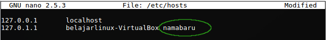
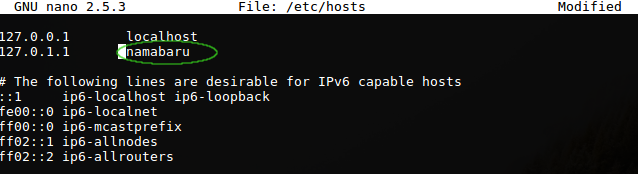
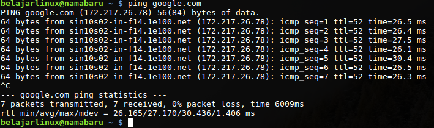
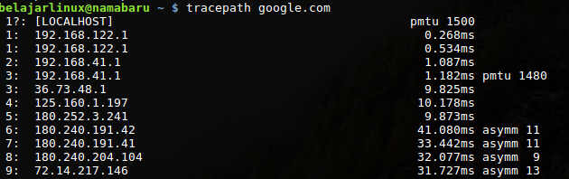
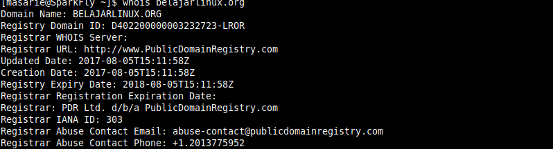

# Mengetahui informasi jaringan dan perangkat jaringan

### Informasi ip perangkat jaringan

  kita bisa mengetahui informasi ip kita dengan menuliskan command

    ifconfig -a
    atau
    ip adress

  `ifconfig -a` akan menampilkan semua perangkat network termasuk yang terdisable serta informasi ip , mac, dam status perangkat lain

  `ip adress` akan menampilkan informasi ip dan perangkat jaringan yang ada.

# Prerintah dasar setting jaringan di Linux

 Di linux kita bisa menggunakan command linux untuk mengkonfigurasi jaringan tanpa harus masuk GUI.

### Merubah Hostname/Computer Hostname

  Hostname juga dikenal dengan computer name,kita bisa merubah hostname dengan mengikuti langkah - langkah berikut.

  1.Menambahkan Hostname baru yang kamu inginkan pada file /etc/hosts , di sebelah kanan Hostname lama tanpa harus mengahapusnya, Dengan menggunakan command

    sudo nano /etc/hosts

  2.Mengedit isi file /etc/hostname dengan command

    sudo nano /etc/hostname

   tanda pagar tidak akan di jalankan oleh mesin.

  3.Edit kembali file /etc/hosts dengan perintah

    sudo nano /etc/hosts

  dan hapus hostname lama.

  4.Setelah kita merubah hostname, kita harus mereboot terlebih daahulu agar hostname nya dapat berjalan.
   Untuk mereboot bisa menngunakan command

      reboot
      atau
      init 6

# Perbedaan IP Static dan IP Dynamic

  IP Static adalah ip yang kita dapatkan dari perangkat kita, sedangkan IP Dynamic adalah ip yang diberikan oleh sytem DHCP (Dynamic Host Configuration Protocol).

# Command dasar Linux untuk mengelola jaringan

  1.Ping (Packet Inster Groper)

  Perintah ping digunakan untuk mengetest tersmabungnya jaringan antara 2 host.

  2.Netstat

  Command netstat sangat banyak parameter nya.
  jika kita ingin melihat gateway (jalur routing) kita bisa menggunakan
  command `netstat -r` .
  jika ingin melihat port yang terbuka kita bisa menggunakan `netstat -tulpn` .

  3.Tracepath

  Perintah tracepath digunakan untuk melihat gateway yang tidak stabil saat kamu menuju website.

  4.who is

  Diuganakan untuk melihat data register kepemilikan sebuah domain.

  ifdown dan ifup

    sudo ifup nama-interface

untuk enable network interface

    sudo ifdown nama-interface

untuk disable network interface

### Untuk melihat gateway ada banyak command

    ip route show
    route
    netstat -r

### DNS (Domain Name Server)

  Nama dari IP website

### Mac adress

  Nomer seri suatu hardware

Sumber :

[Basic Networking linux](https://www.belajarlinux.org/mengetahui-informasi-dan-setting-jaringan-dengan-perintah-dasar-linux/)
