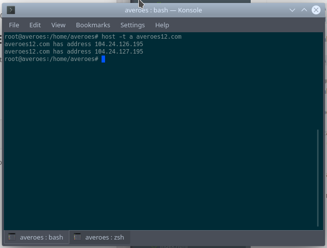
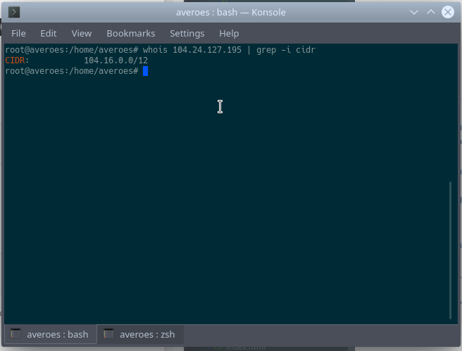

# Penjelasan chain

   `iptables` menggunakan tiga chain berbeda :
   - input
   - output
   - forward

  * INPUT = Chain yang digunakan untuk koneksi masuk. Contohnya, jika seseorang mencoba untuk melakukan SSH ke komputer anda, iptables akan mencocokkan alamat IP dan memberikan port pada INPUT chain.

  * FORWARD = Chain yang digunakan untuk koneksi masuk, chain forward sama seperti mem forward pesan, Contoh bila kita menggunakan linux sebagai router maka paket data yang datang ke router bukan di tujukan untuk router, akan tetapi router akan mem forward paket data ke tujuan yang diinginkan.
  
  * OUTPUT = Chain yang digunakan untuk koneksi keluar. Contoh ketika sistem linux melakukan proses updating sehingga membutuhkan koneksi ke luar.

# Konfigurasi `iptables` 

### Melihat konfigurasi yang diterapkan di iptables

  `iptables -L -v` 

  -L = List 
  -v = menampilkan informasi rinci.

### Menolak semua sambungan 

  `iptables -P INPUT DROP`
  `iptables -P OUTPUT DROP`
  `iptables -P FORWARD DROP`

### Menambahkan aturan baru 
  
   Pada bagian ini akan 3 perintah dasar yang sering digunakan 

   1. ACCEPT = Menerima sambungan.
   2. DROP = Menolak sambungan tapi tidak mengirim pesan error.
   3. REJECT = Menolak samnungan dan mengirim pesan error.

   Untuk menambahkan aturan kepada chain yang ada kita mengguanakan `iptables -A` 

   Untuk menyeting ulang aturan yang telah kita buat, bisa mengguanakan `iptables -F` 

#### #Memutuskan Koneksi masuk

   `iptables -P INPUT DROP
   iptables -P FORWARD DROP
   iptables -P OUTPUT ACCEPT`

#### #Menolak data yang masuk melalui IP tertentu

   `iptables -A INPUT -s 192.168.100.09 -j REJECT/DROP` 

   Kita menolak semua paket masuk yang berasal dari IP di atas.

   \*untuk interface bisa dilihat di `ifconfig`
   
#### #Drop private network pada public interface

   `iptables -A INPUT -i (nama-interface-yg-ingin-di-atur) -s 192.168.100.09 -j REJECT/DROP`

#### #Menolak paket data yang masuk berdasarkan port 

   `iptables -A INPUT -p tcp --dport (nomer port yang ingin di blok) -j DROP/REJECT`

   jika protokol yang kita ingin gunakan adalah udp  maka tulis `-p udp`

#### #Memblock port hanya untuk IP tertentu 

   `iptables -A INPUT -p tcp -s (alamat ip yang ingin kita block) --dport (portyang ingin di blok) -j REJECT/DROP`

#### #Menolak paket data yang masuk dengan range port 

   `iptables -A INPUT -p tcp --dport 22:9999 -j DROP`

   Sehingga semua paket data yang masuk dengan protokol tcp ke port 22 hingga 9999 di tolak.

#### #Memblock koneksi keluar ke host atau domain tertentu

   pertama mencari alamat ip nya dengan memasukkan
   ` host -t a (nama domain nya)
   contoh

     host -t a averoes12.com`

  maka akan menghasilkan output

   alamat ip dan tipe berikut untuk memblokir semua koneksi yang keluar untuk ke alamat ip di gambar

   lalu kita masukkan command :

   `iptables OUTPUT -d (alamat ip nya) -j DROP`

#### #Contoh Memblock domain averoes12.com

   Pertama cari alamat ip nya

   `host t a averoes12.com` 

   Ouput 

   lalu cari cidr dari ip tersebut 

   untuk mencegah akses keluar ke www.averoes12.com masukkan perintah

    iptables -A OUTPUT -p tcp -d (cidr yang tadi dicari) -j DROP   

  Kita juga bisa menggunakan nama domainnya 

  `iptables -A OUTPUT -p tcp -d www.facebook.com -j DROP`

#### #Drop atau accept traffic dari mac address

  `iptables -A INPUT -m mac --mac-source (mac adress) -j DROP`

  atau 

  `iptables -A INPUT -p tcp -dport (nomer port) -m mac --mac-source (mac address) -j ACCEPT`

#### #Block atau allow icmp ping request

  `iptables -A INPUT -i (interface) -p icmp -j DROP`

#### #Membuka rentang alamat ip

   Hanya akan menerima koneksi ke port tujuan jika ip nya antara sekian dan sekian 

   `iptables -A INPUT -p tcp -dport (nomer port) -m iprange --src-range (ip pertama)-(ip ke dua) -j ACCEPT`

   contoh

   `iptables -A INPUT -p tcp -dport 80 -m iprange --src-range 192.168.100.10-192.168.100.200 -j ACCEPT`

#### #Tes Firewall

   `netstat -tlupn`

   
# NB :
   - \-A = add
   - \-i = interface
   - \-p = protocol
   - \-dport = destination port
   - \-j = jump (target)

Untuk lebih lengakap bisa lihat di `man iptables` karna disitulah kunci dari semua fungsi perintah di linux.

*source :* 

[https://www.cyberciti.biz/tips/linux-iptables-examples.html](https://www.cyberciti.biz/tips/linux-iptables-examples.html)

[https://idcloudhost.com/panduan/konfigurasi-sederhana-iptables/](https://idcloudhost.com/panduan/konfigurasi-sederhana-iptables/)

[https://segiempat.com/tips-dan-cara/teknologi/komputer/cara-menggunakan-firewall-linux-iptables/](https://segiempat.com/tips-dan-cara/teknologi/komputer/cara-menggunakan-firewall-linux-iptables/)

