# Membuat aplikasi dzikir pagi petang dengan app inventor

Bagi yang belum tau, app inventor adalah website untuk membuat aplikasi android secara online.

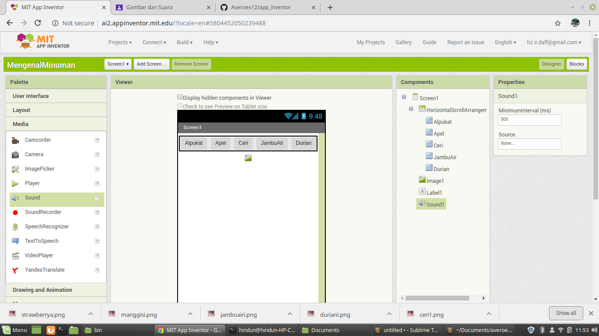

Pada kali ini saya akan membuat aplikasi dzikir pagi dan petang

# Step 1

Buka web app inventor dan login dengan gmail kalian

[appinventor](http://ai2.appinventor.mit.edu)

# Step 2

Lalu klik "start new project"

Isi nama projek kalian lalu klik ok

# Step 3

seret text label ke dalam screen,lalu klik text label untuk mengkofigurasi

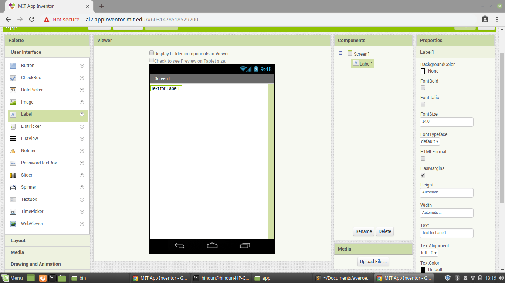

# Step 4

Ubah isi text di panel sebelah kiri, berikan nama Dzikir Pagi Petang

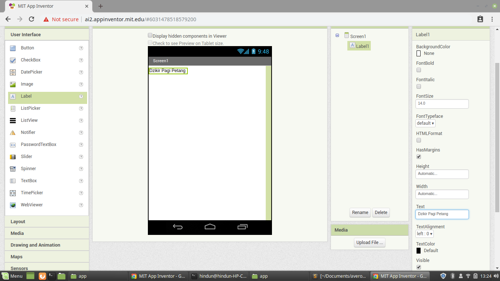

# Step 5 

Bold tulisan dengan klik checkbox font bold

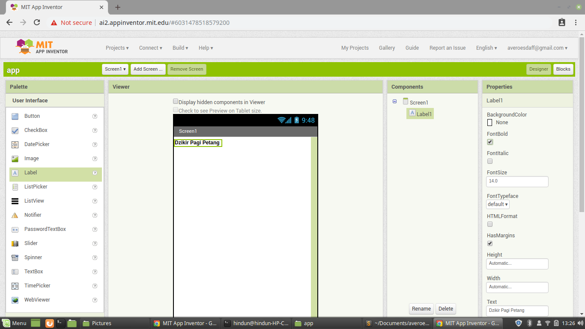

# Step 6 

mengatur alignment dengan klik screen dan atur alignment di panel sebelah kiri

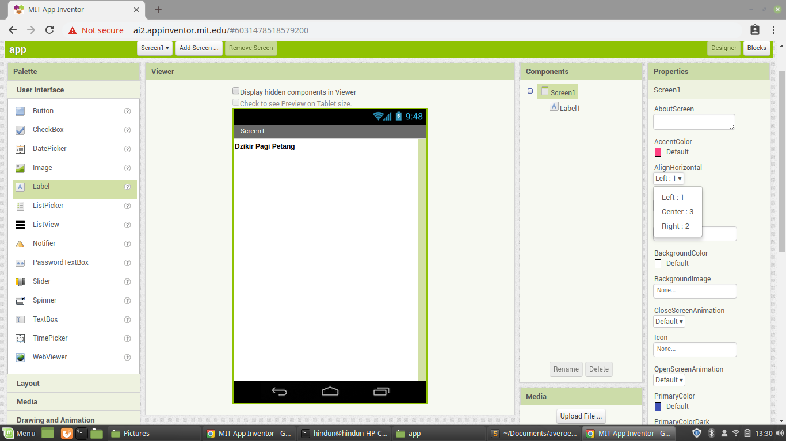

# Step 7

lalu seret button ke dalam screen dan ubah nama button dengan "Dzikir Pagi"

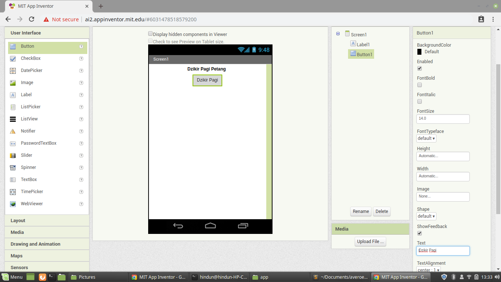

# Step 8

Buatlah seperti ini 

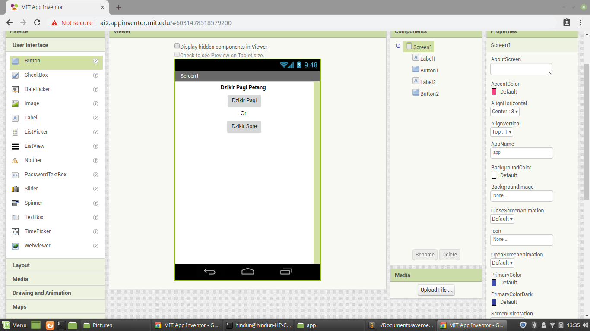

# Step 9

Lalu buat Screen baru lagi dengan nama "DzikirPagi"

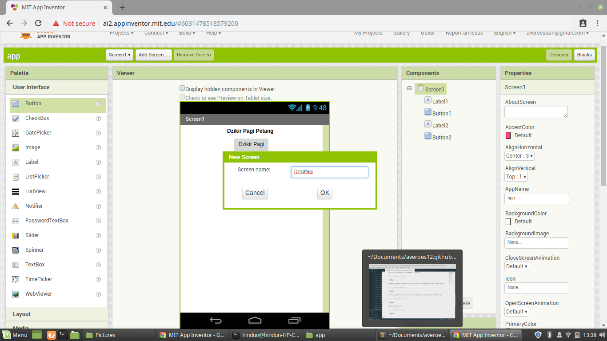

# Step 10

lalu buatlah seperti gambar dibawah ini

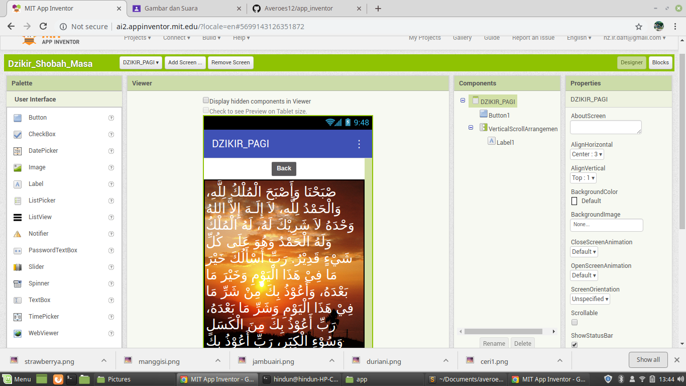

Untuk tulisan bisa copas dari google
Untuk gambar bisa di masukkin di screen,atau lewati saja dulu

# Step 11

jika sudah selesai buat screen baru lagi dengan nama "DzikirPetang"

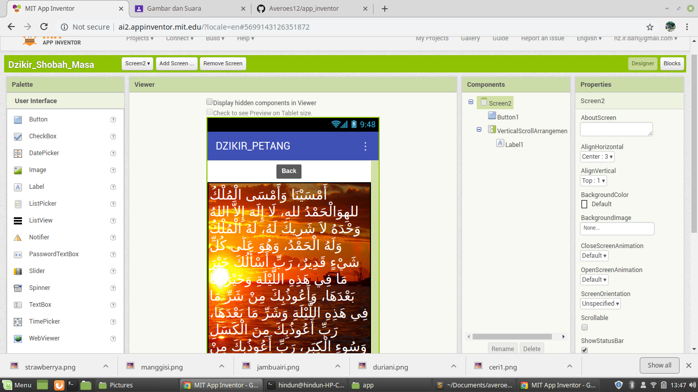

# Step 12

Masuk ke "blocks" di pojok kanan atas disamping tulisan designer

# Step 13

Lalu klik "button" di panel sebelah kiri, lalu pilih "when button click do"

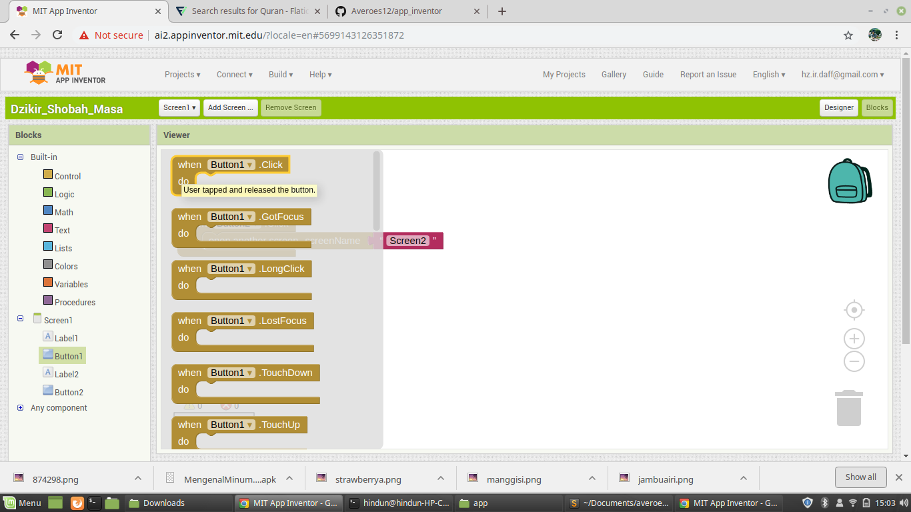

# Step 14 

Lalu klik control di panel kiri, dan pilih open screen screen name

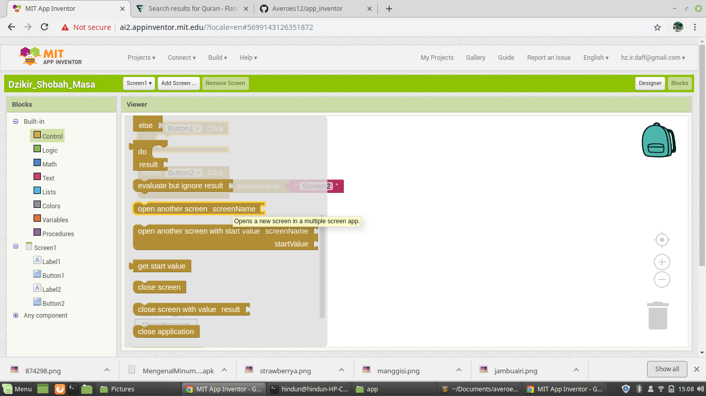

lalu letakkan di block "when button click do"

# Step 15

lalu klik text di panel kiri, lalu pilih paling pertama

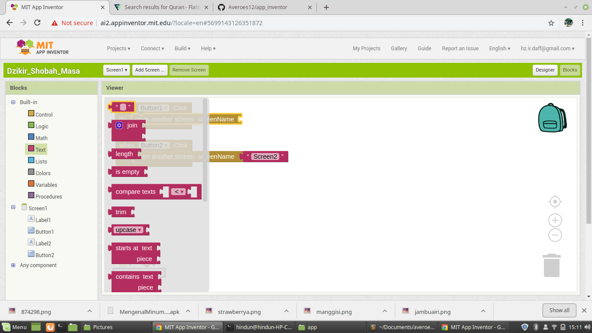

# Step 16

Lalu tuliskan nama screen yang pertama kita buat

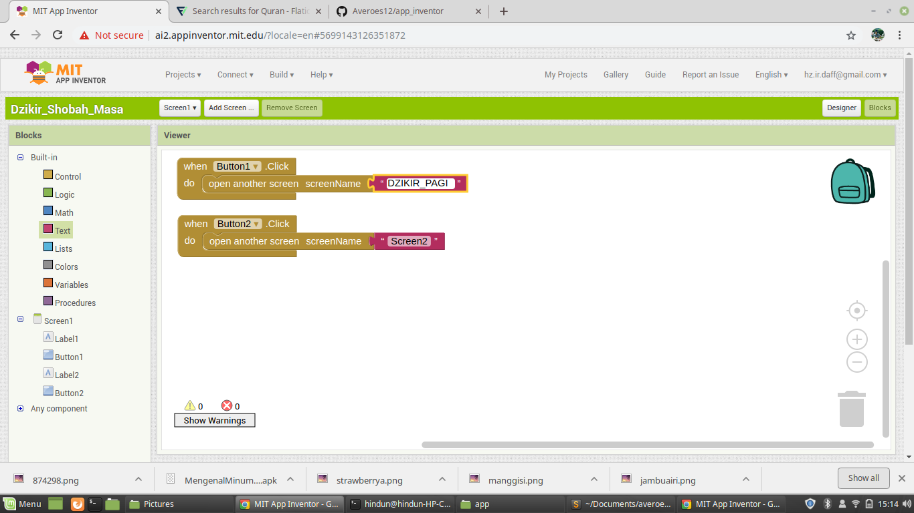

# Step 17

Masuk ke screen yang pertama kali kita buat lalu buat block seperti yang kita lakukan tadi

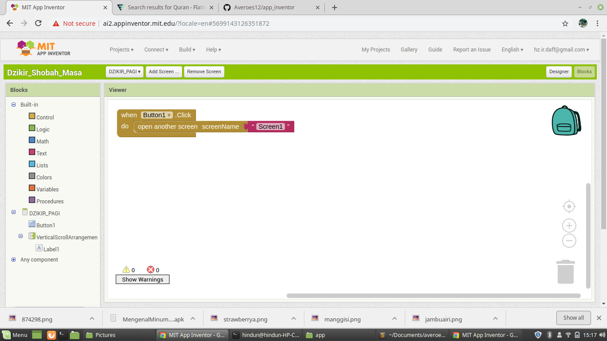

# Step 18

Masuk ke screen yang kedua dan lakukan hal yang sama seperti tadi

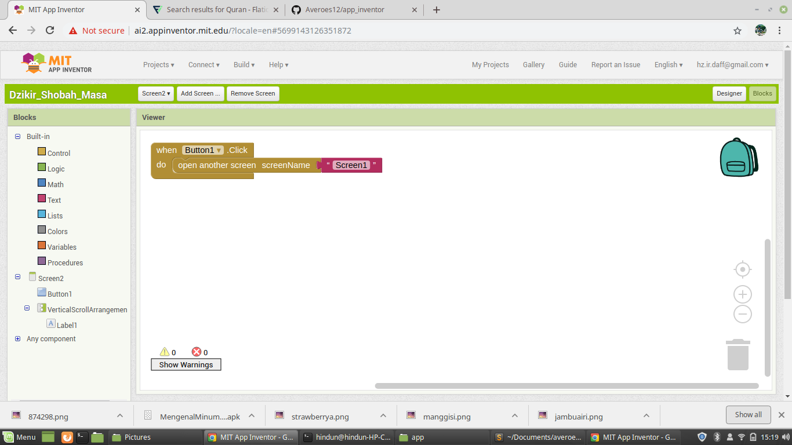

# Step 19

Lalu setelah semua selesai jika kita ingin menjalanka apk nya lewat emulator di laptop, maka kita harus mem build projek kita tadi

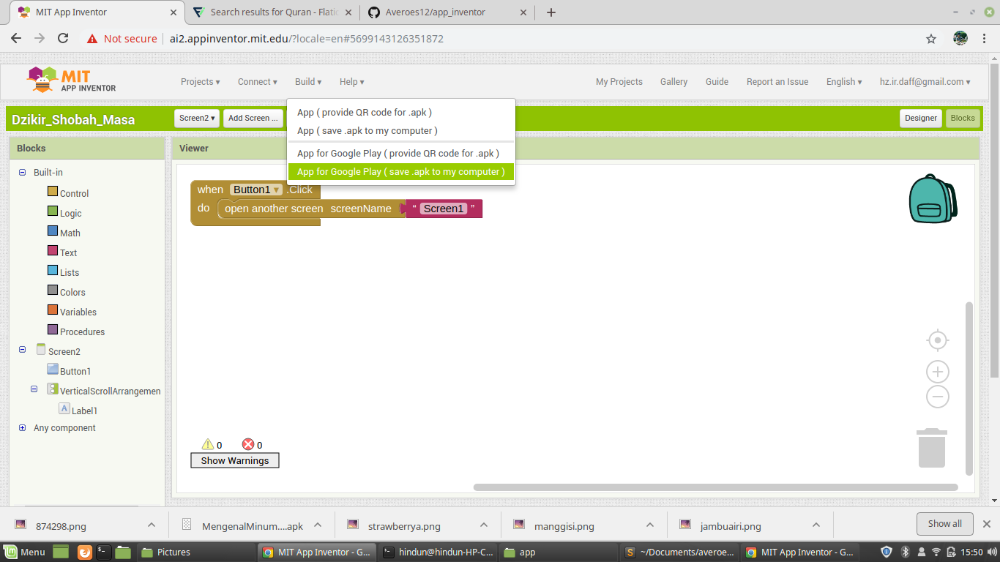

# Step 20

Kita tunggu hingga selesai, lalu kita jalankan apk nya di emulator kita

namun kita juga bisa langsung menjalankannya di hp dengan aplikasi app inventor yang sudah tersedia di playstore

# Menjalankan langsung di android

Pertama kita klik "Connect" lalu pilih yang paling pertama

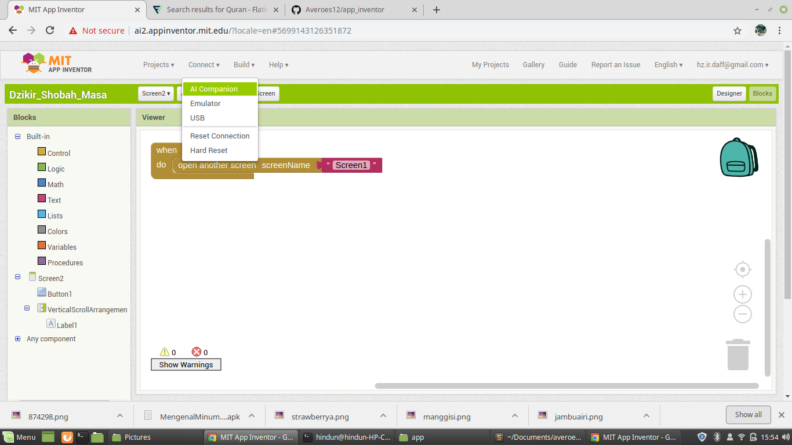

Lalu bisa di scan barcode nya atau kita masukkan kodenya ke dalam aplikasi yang sudah kita install tadi.

Mungkin sekian semoga bermanfaat....