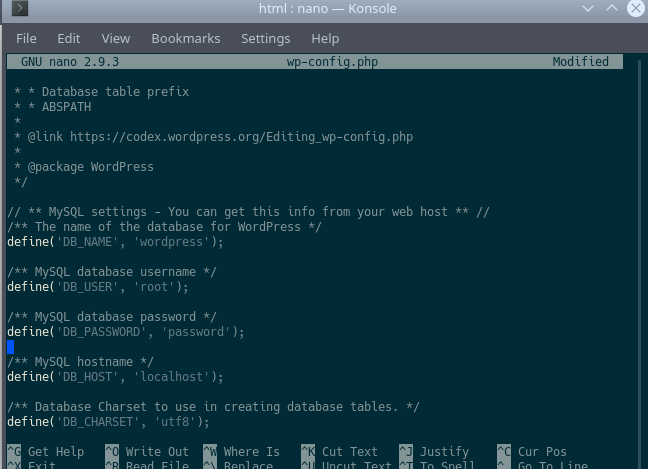
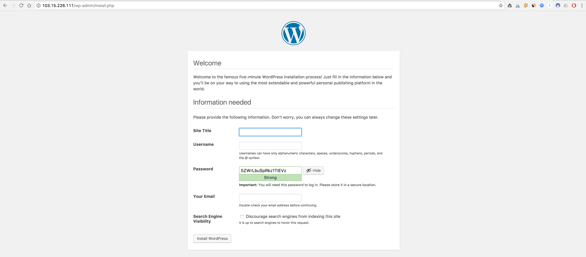

Pada kali ini saya akan sharing tentang cara menginstall wordpress di linux

# First Step

Langkah pertama kita harus menginstall apache

    sudo apt update
    sudo apt install apache2

# Second Step

Selanjutnya kita install mysql server dan client

    Sudo apt install mysql-server mysql-client

# Third Step 

Lalu kita install php

    sudo apt-get install software-properties-common
    sudo add-apt-repository ppa:ondrej/php
    sudo apt-get update 

  Install php versi 7.2

        sudo apt-get install libapache2-mod-php7.2 php7.2 php7.2-common

  setelah di install kita restart web server kita yaitu apache

        sudo service apache restart2

  Untuk Mengecek versi php kita 

  `php -v`

  lalu kita uji coba php kita dengan file info php

    sudo nano /var/www/html/info.php

lalu kita isikan

`<?php phpinfo(); ?>`

jika berhasil maka hasilnya akan seperti ini

# Fourth Step

Selanjutnya kita membuat sebuah user dan database Mysql untuk wordpress

Pertama kita membuat password untuk mysql kita dengan menngetikkan command ini `mysql_secure_installation`

selanjutnya kita masuk ke mysql dengan command `mysql -u root -p`

lalu kita buat database

`CREATE DATABASE wordpress;`

lalu buat username dari database

`CREATE USER username@localhost IDENTIFIED BY 'password;`

lalu kita memberi hak akses kepada user baru agar dapat mengakses database

`GRANT ALL PRIVILEGES ON wordpress.* TO username@localhost;`

lalu kita menyimpan perubahan yang kita buat

`FLUSH PRIVILEGES;`

lalu keluar dari my sql 

`exit`

# Fifth Step 

Kita download wordpress nya dengan menggunakan command
Sebelum mendownload kita balik dulu ke direktori home

`cd ~`
lalu ketik
`wget http://wordpress.org/latest.tar.gz`

lalu kita extrac file nya

`tar zxvf latest.tar.gz`

### Konfigurasi wordpress

Pertama kita salin file *wp-config-sample.php* ke dalam *wp-config.php*

`cp /wordpress/wp-config-sample.php /wordpress/wp-config.php`

lalu kita edit file *wp-config.php*

`sudo nano /wordpress/wp-config.php`

lalu kita cari parameter **DB_NAME** **DB_USER** dan **DB_PASSWORD**

kita isikan seperti berikut

Lalu kita salin file source code wordpress ke root

`mv ~/worpress/* /var/www/html/`

Selanjutnya kita masuk ke direktori html

`cd /var/www/html/`

lalu kita buat direktori baru di *wp-content* dengan nama uploads

`mkdir /wp-content/upload`

selanjutnya kita jalankan perintah berikut 

`sudo chown -R :www-data /wp-content/uploads`

# Final Step

Oke sekarang kita buka browser kita dan kita masukkan ip address kita 

dan akan keluat seperti ini

Lalu isi form tersebut dan wordpress telah berhasil di install

