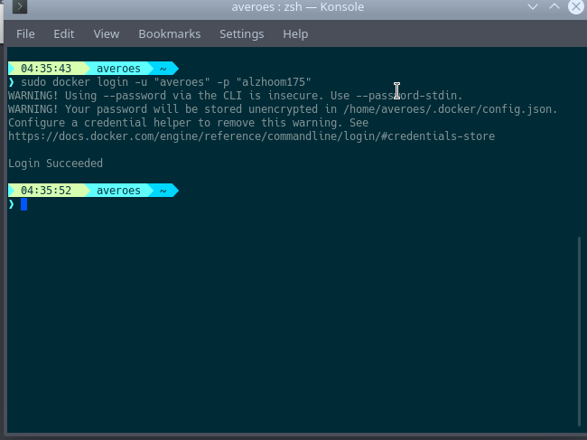
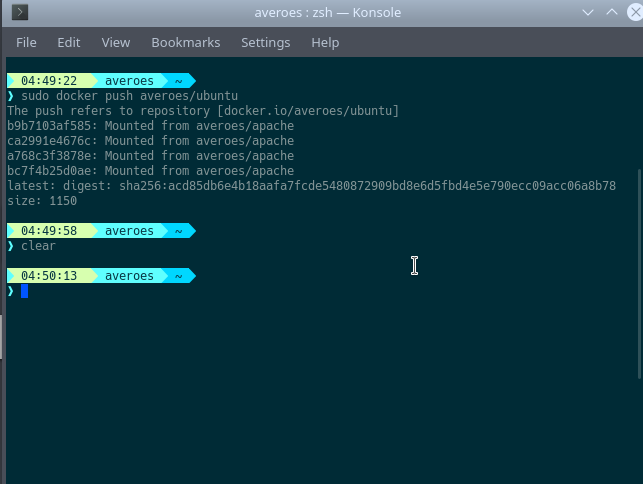

Pada kali ini saya akan sharing bagaimana cara kita untuk mempublish docker images kita yang kita telah buat agar bisa dilihat oleh orang

langsung aja ya...

# First Step

Pertama kita login docker hub kita terlebih dahulu di terminal kita dengan perintah 

`sudo docker login -u "username" -p "password"`

Jika berhasil maka akan tampil seperti ini

# Second Step 

Setelah kita login kita tag image yang akan kita push dengan perintah

`sudo docker tag centos averoes/centos`

*centos* bisa kalian ganti denga nama image yang akan kalian push 

*averoes/centos* ganti dengan username docker hub kalian dan repository kalian

# Third Step

Setelah kita tag image nya saatnya kita masuk ke langkah yang terakhir yaitu push image, kita push image yang sudah kita tag tadi dengan menggunakan perintah

`sudo docker push averoes/centos`

*averoes/centos* kalian ganti dengan nama repository yang kalian buat pada saat kalian men tag image nya

lalu kita tunggu prosesnya, jika berhasil maka akan seperti ini

Oke sekian dari saya 

semoga bermanfaat

Trimss..

