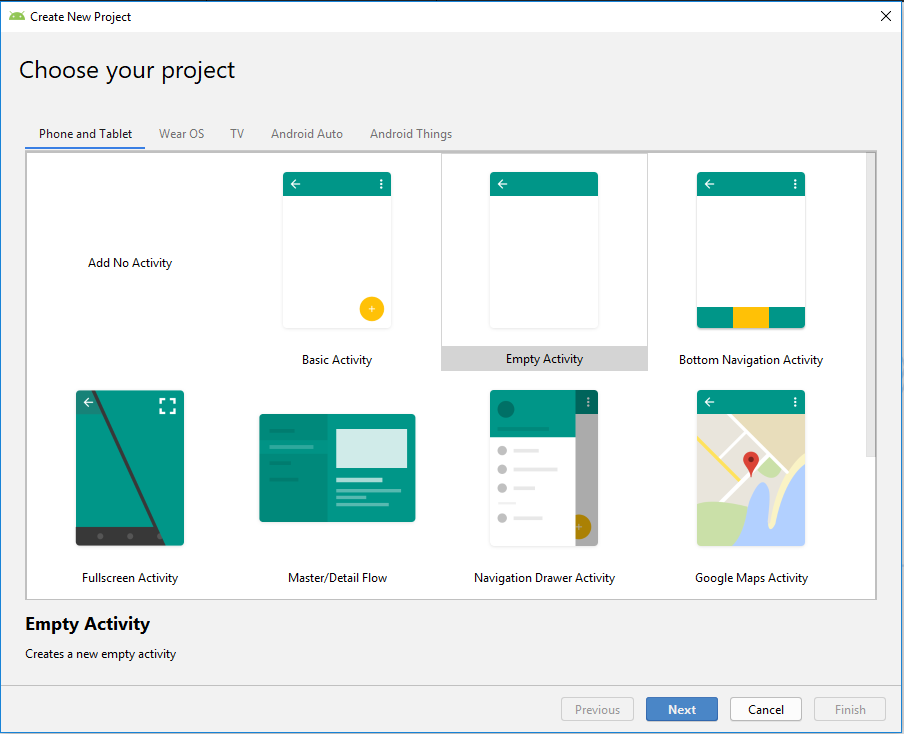
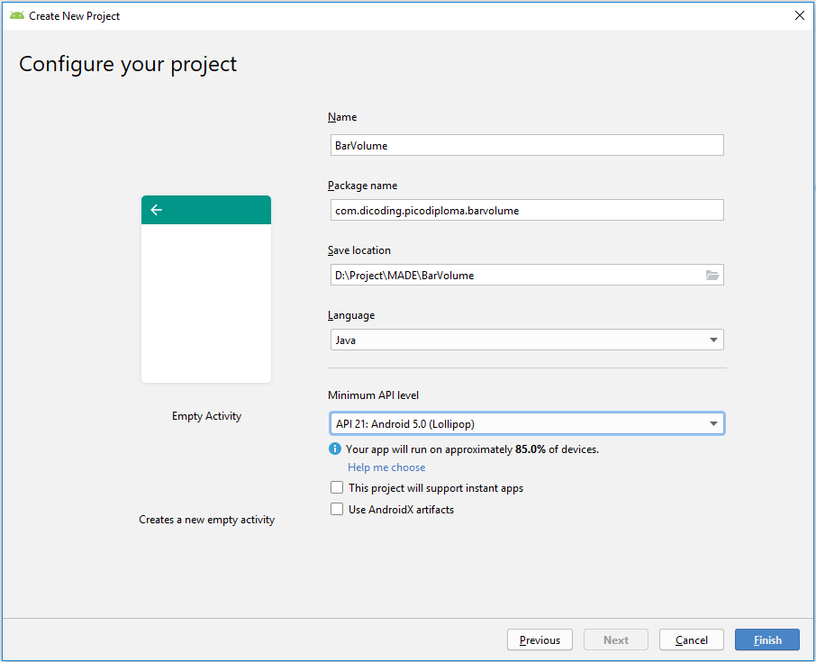
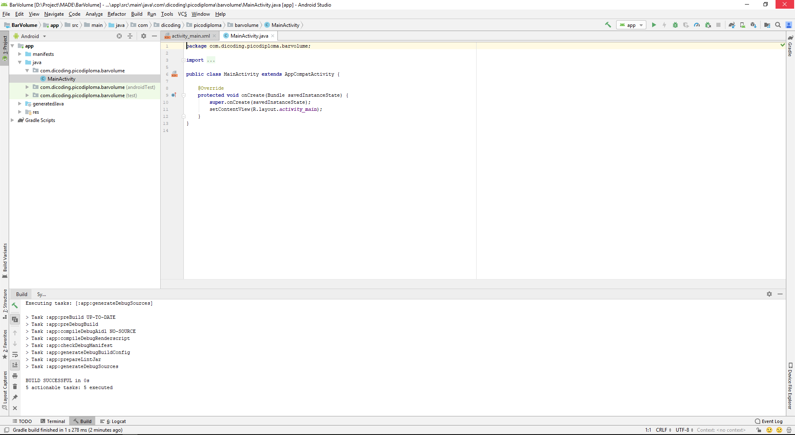
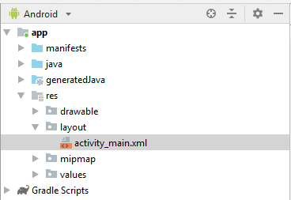
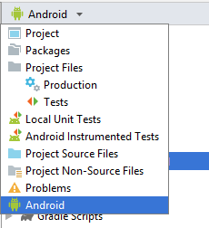
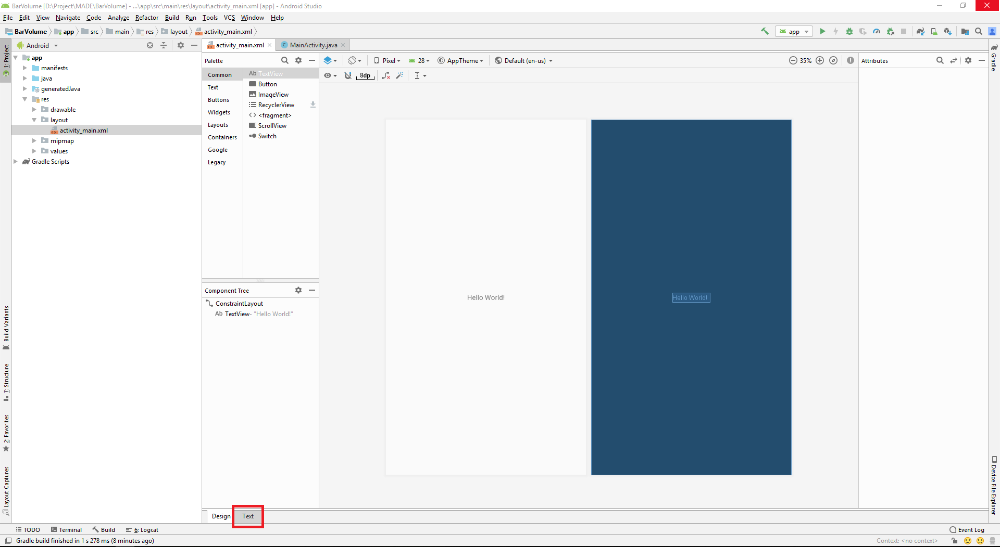
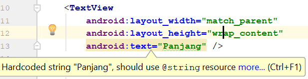
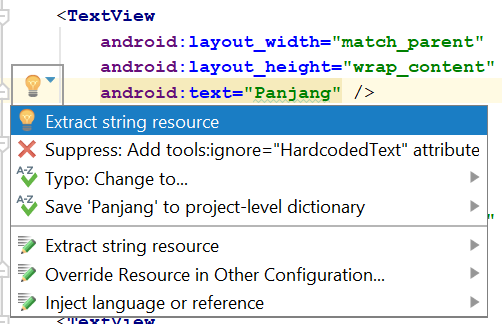

## Activity itu apa sih??
  Mungkin bagi kalian yang belum pernah mendengar kata "activity" akan mencoba untuk menerka-nerka, itu makanan apa sih, rasanya enak ga ya??
  tapi bukan itu ya.

  Activity adalah sebuah tempat untuk menampilkan UI atau User Interface dari sebuah aplikasi tanpa adanya activity UI tidak akan bisa ditampilkan, lihat gambar di bawah


  Pada gambar tersebut ada beberapa gambar atau view-view yang ditampilkan dalam sebuah device, nah komponen untuk menampilkan view tersebut dinamakan activity.

  Oke daripada bingung kita langsung aja buat sebuah apliksi android sederhana.

  Kita akan membuat sebuah aplikasi untuk menghitung volume balok, berikut tampilannya.


#### First Step

  Buka Android Studio lalu pilih File -> New -> New Project


#### Second Step

  Pada bagian ini kita akan memilih tipe activity awal dari template yang telah disediakan.

 Saat ini Android Studio sudah menyediakan berbagai macam template activity dari yang paling sederhana hingga yang paling kompleks
 seperti:

Add No Activity : Tidak ada activity yang ditambahkan.

Basic Activity : Activity dengan template komponen material design seperti FloatingActionButton.

Bottom Navigation Activity : Activity dengan tampilan side bar menu di bagian bawah.

Empty Activity : Activity dalam bentuk yang paling dasar.

Fragment + ViewModel : Activity dengan menerapkan architecture component.

Fullscreen Activity : Activity fullscreen tanpa status bar.

Google AdMob Ads Activity : Activity dengan konfigurasi default iklan Admob.

Google Maps Activity : Activity dengan menyediakan konfigurasi dasar Google Maps.

Login Activity : Activity untuk halaman login.

Master / Detail Flow : Activity yang diperuntukan untuk alur aplikasi master detail pada peranti tablet.

Navigation Drawer Activity : Activity dengan tampilan side bar menu.

Scrolling Activity : Activity dengan kemampuan scroll konten didalamnya secara vertikal.

Settings Activity : Activity yang diperuntukan untuk konfigurasi aplikasi.

Tabbed Activity : Activity yang diperuntukan untuk menampilkan lebih dari satu tampilan, dapat digeser ke kanan dan ke kiri (swipe) dan dengan menggunakan komponen [ViewPager](https://developer.android.com/reference/android/support/v4/view/ViewPager).

Selain itu, Anda juga bisa memilih target device mana yang akan Anda buat seperti Phone and Tablet, Wear OS, TV, Android Auto atau Android Things.



Saat ini kita pilih tipe Empty Activity, klik Next untuk melanjutkan.

#### Third Step

Selanjutnya masukkan nama aplikasi dan nama package aplikasi Anda. Sebaiknya jangan sama dengan apa yang ada di contoh, karena ini berfungsi sebagai id dari aplikasi yang Anda buat. Kemudian Anda bisa menentukan lokasi proyek yang akan Anda buat. Setelah itu pilih tipe gawai / peranti (device) untuk aplikasi beserta target minimum SDK yang akan digunakan. Pilihan target Android SDK akan mempengaruhi banyaknya peranti yang dapat menggunakan aplikasi. Di sini kita memilih nilai minimum SDK kita pasang ke Level 21 (Lollipop). Klik Finish untuk melanjutkan.



Tampilan layar Anda akan seperti contoh di bawah ini:



Di sebelah kanan Anda adalah workspace di mana Activity anda berada dan bernama MainActivity.java dengan layoutnya activity_main.xml. Di sebelah kiri Anda terdapat struktur proyek, di mana nanti kita akan banyak menambahkan berbagai komponen baru, asset dan library. Untuk lebih mengenal Android Studio lebih dalam silakan baca materi [ini](https://developer.android.com/studio/intro/index.html)

Selanjutnya kita akan mulai melakukan pengkodean aplikasi atau lebih enaknya disebut ngoding.

Berikut flow umumnya.

Ngoding Layout untuk user interface aplikasi
Ngoding Activity untuk menambahkan logika aplikasi


Untuk mengoptimalkan proses pengetikan, Anda dapat memanfaatkan code completion dengan menekan ctrl + space. Android Studio juga akan mengimpor package dari komponen yang digunakan.

Dilarang Keras untuk copy - paste! Ngoding pelan-pelan akan membuat Anda lebih jago di masa depan.

### Menambahkan Code Sederhana pada Layout Activity

1.Silakan pilih tab berkas activity_main.xml pada workspace Anda(res/layout/activity_main.xml).



Pastikan project window pada pilihan Android, seperti di bawah ini.



Maka akan ada tampilan seperti ini, kemudian pilih metode `text`.



Dan tambahkan baris-baris berikut:

```
<?xml version="1.0" encoding="utf-8"?>
<LinearLayout xmlns:android="http://schemas.android.com/apk/res/android"
    xmlns:tools="http://schemas.android.com/tools"
    android:layout_width="match_parent"
    android:layout_height="match_parent"
    android:paddingBottom="@dimen/activity_vertical_margin"
    android:paddingLeft="@dimen/activity_horizontal_margin"
    android:paddingRight="@dimen/activity_horizontal_margin"
    android:paddingTop="@dimen/activity_vertical_margin"
    android:orientation="vertical"
    tools:context="com.dicoding.picodiploma.barvolume.MainActivity">

    <TextView
        android:layout_width="match_parent"
        android:layout_height="wrap_content"
        android:text="Panjang" />
    <EditText
        android:id="@+id/edt_length"
        android:layout_width="match_parent"
        android:layout_height="wrap_content"
        android:inputType="numberDecimal"
        android:lines="1" />
    <TextView
        android:layout_width="match_parent"
        android:layout_height="wrap_content"
        android:text="Lebar" />
    <EditText
        android:id="@+id/edt_width"
        android:layout_width="match_parent"
        android:layout_height="wrap_content"
        android:inputType="numberDecimal"
        android:lines="1" />
    <TextView
        android:layout_width="match_parent"
        android:layout_height="wrap_content"
        android:text="Tinggi" />
    <EditText
        android:id="@+id/edt_height"
        android:layout_width="match_parent"
        android:layout_height="wrap_content"
        android:inputType="numberDecimal"
        android:lines="1" />
    <Button
        android:id="@+id/btn_calculate"
        android:layout_width="match_parent"
        android:layout_height="wrap_content"
        android:text="Hitung" />
    <TextView
        android:id="@+id/tv_result"
        android:layout_width="match_parent"
        android:layout_height="wrap_content"
        android:gravity="center"
        android:text="Hasil"
        android:textSize="24sp"
        android:textStyle="bold" />
</LinearLayout>
```

Pada contoh di atas kita menggunakan LinearLayout, jika kita menggunakan android studio versi 3 ke atas default nya adalah ConstraintLayout, agar sesuai maka tinggal dirubah menjadi LinearLayout.

2.Kemudian akan muncul warning pada atribut android:text pada layout tersebut.



Ini karena kita melakukan *hardcoding* pada nilai string-nya. Mari kita hilangkan code *warning* tersebut dengan menekan **Alt+Enter (option + return pada Mac)** atau menekan lampu kuning yang muncul pada attribut android:text.
Akan muncul dialog seperti ini, pilih **extract string resource**.



3.Kemudian akan muncul dialog seperti di bawah ini. Sesuaikan dengan nama yang ada.
